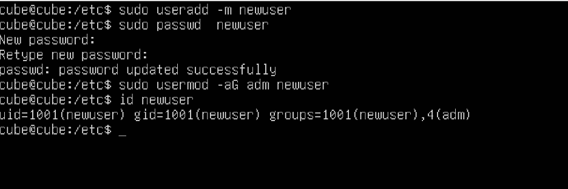
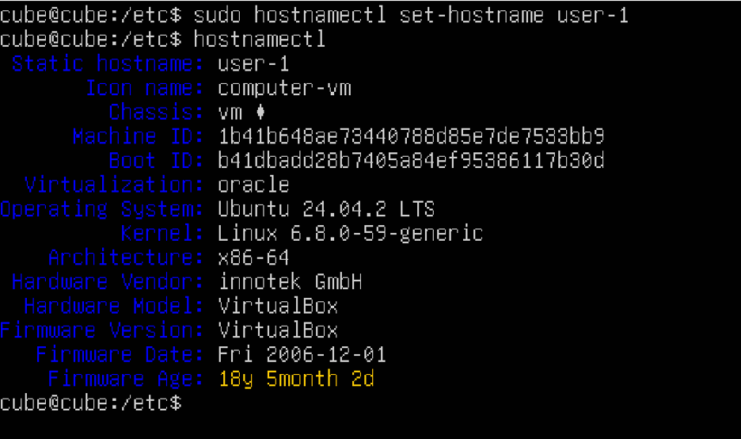
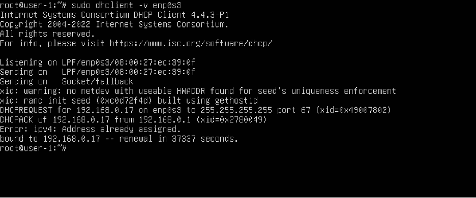
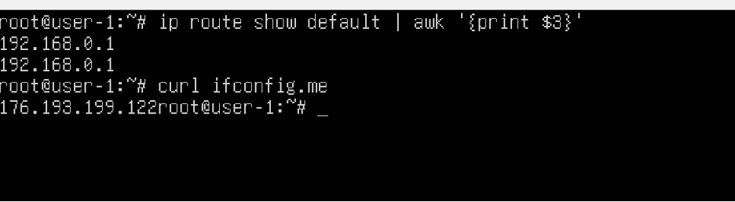
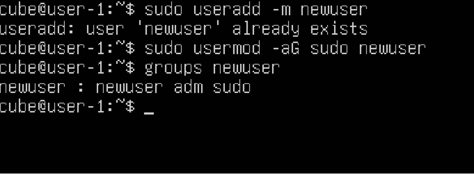
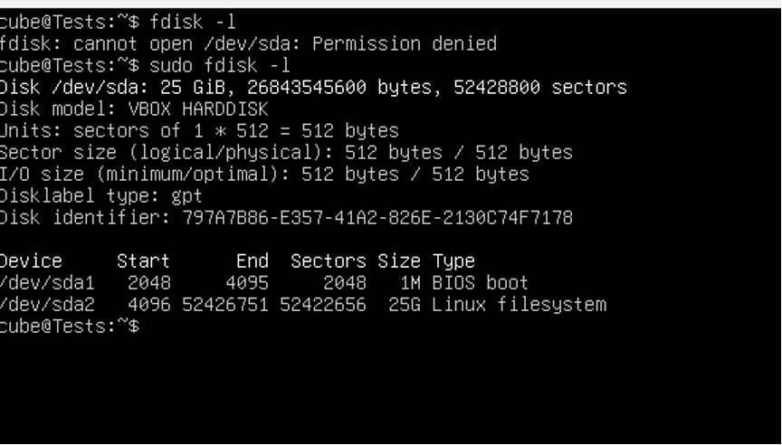
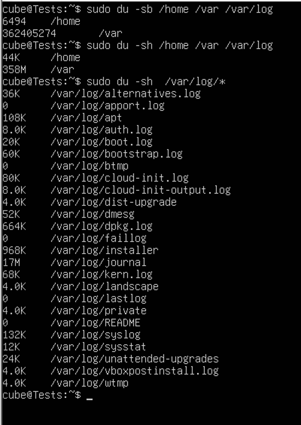
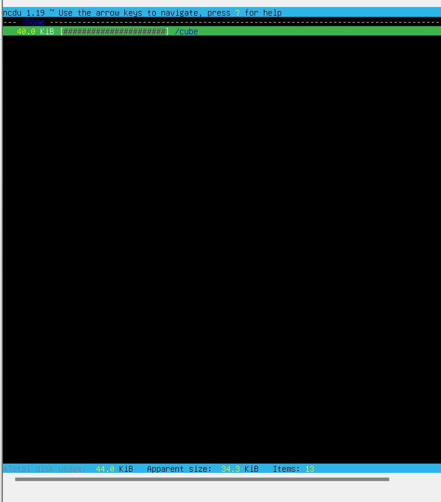
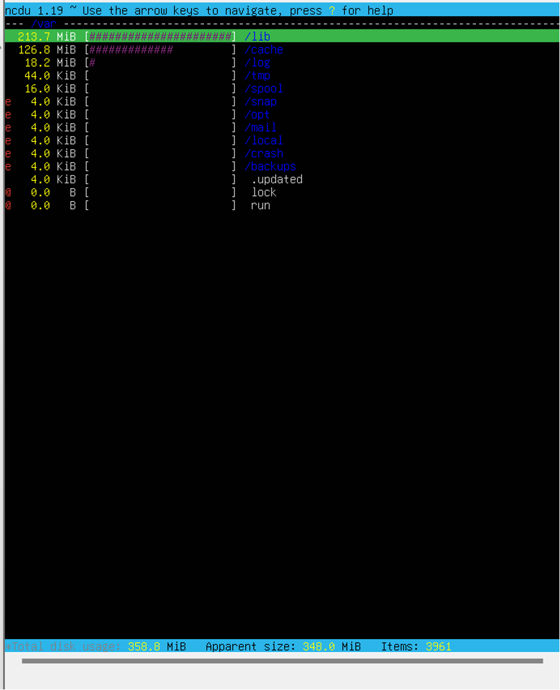

## Part 1. Установка ОС

###### Задание: 

- Установи **Ubuntu 20.04 Server LTS** без графического интерфейса. (Используем программу для виртуализации - VirtualBox)
- Графический интерфейс должен отсутствовать.
- Узнай версию Ubuntu, выполнив команду \
`cat /etc/issue.`
- Вставь скриншот с выводом команды.

###### Решение:

**TODO: переделать, вставить скрин команды `cat /etc/issue.`**

---

## Part 2. Создание пользователя

###### Задание: 

- Создай пользователя, отличного от созданного при установке. Пользователь должен быть добавлен в группу `adm`.
- Вставь скриншот вызова команды для создания пользователя.
- Новый пользователь должен быть в выводе команды \
`cat /etc/passwd`
- Вставь скриншот с выводом команды.

###### Решение:

#### 1 Создадим нового пользователя и добавим его в группу `adm`:



#### 2 Проверим его существование с помощью команды `cat /etc/passwd`:

**TODO: переделать, вставить вывод команды `cat /etc/passwd`**

---

## Part 3. Настройка сети ОС

###### Задание: 
- Задай название машины вида user-1. 
- Установи временную зону, соответствующую твоему текущему местоположению. 
- Выведи названия сетевых интерфейсов с помощью консольной команды.
- В отчёте дай объяснение наличию интерфейса lo.  
- Используя консольную команду, получи ip адрес устройства, на котором ты работаешь, от DHCP сервера. 
- В отчёте дай расшифровку DHCP.  
- Определи и выведи на экран внешний ip-адрес шлюза (ip) и внутренний IP-адрес шлюза, он же ip-адрес по умолчанию (gw). 
- Задай статичные (заданные вручную, а не полученные от DHCP сервера) настройки ip, gw, dns (используй публичный DNS серверы, например 1.1.1.1 или 8.8.8.8).  
- Перезагрузи виртуальную машину. Убедись, что статичные сетевые настройки (ip, gw, dns) соответствуют заданным в предыдущем пункте.  
- В отчёте опиши, что сделал для выполнения всех семи пунктов (можно как текстом, так и скриншотами).
- Успешно пропингуй удаленные хосты 1.1.1.1 и ya.ru и вставь в отчёт скрин с выводом команды. В выводе команды должна быть фраза «0% packet loss».

###### Решение:

#### 1 Задать название машины:



#### 2 Установка временной зоны:


#### 3 Вывод названий сетевых интерфейсов:


> lo (loopback) — виртуальный интерфейс для локальных соединений внутри устройства. Имеет IP 127.0.0.1 и используется для тестирования сети, доступа к локальным сервисам и изоляции процессов.

#### 4 IP адресс от DHCP сервиса

Подробная сводка:



Команда `ip`:



Расшифровка **DHCP**:

> DHCP (Dynamic Host Configuration Protocol) — это сетевой протокол, автоматически назначающий IP-адреса и другие параметры сети (маску подсети, шлюз, DNS-серверы) устройствам при их подключении, что упрощает настройку и управление сетями. Он работает по модели «клиент-сервер», временно выделяя адреса из заданного диапазона (аренда), что предотвращает конфликты и экономит IP-ресурсы.

#### 5 Внешний и внутренний IP шлюза

**TODO: доделать**

#### 6 Задание статических настроек

**TODO: не нашел скрин, возможно он есть**

#### 7 После перезапуска

**TODO: доделать**

#### 8 Ping удаленных хостов

**TODO: доделать**

---

## Part 4. Обновление ОС

###### Задание:

- Обнови системные пакеты до последней на момент выполнения задания версии.
- После обновления системных пакетов, если ввести команду обновления повторно, должно появиться сообщение, что обновления отсутствуют.
- Вставь скриншот с этим сообщением в отчёт.

###### Решение:

#### 1 Запустим обновление пакетов

**TODO: из за проблем с настройкой сети не прошела операция обновления, она была с ошибкой**

#### 2 Запустим обновление заново и увидим, что нечего обновлять

**TODO: из за проблем с настройкой сети не прошела операция обновления, она была с ошибкой**

---

## Part 5. Использование команды **sudo**

###### Задание:

- Разреши пользователю, созданному в [Part 2](#part-2-создание-пользователя),выполнять команду sudo.
- В отчёте объясни *истинное* назначение команды sudo (про то, что это слово - «волшебное», писать не стоит);  
- Поменяй hostname ОС от имени пользователя, созданного в пункте [Part 2](#part-2-создание-пользователя) (используя sudo);
- Вставь скрин с изменённым hostname в отчёт.

###### Решение:

#### 1 Добавление прав sudo пользователю



#### 2 Назначение команды `sudo`

> Истинное назначение `sudo` — не просто давать root-доступ, а предоставлять контролируемый и аудируемый механизм выполнения команд с повышенными привилегиями, позволяя админам гибко настраивать права пользователей (через `/etc/sudoers`), ограничивать конкретные команды и логировать действия для безопасности.

#### 3 Меняем `hostmane` от имени пользователя

**TODO: неправильно сделал, изменил не hostname а службу времени**

---

## Part 6. Установка и настройка службы времени

###### Задание:

- Настрой службу автоматической синхронизации времени.  
- Выведи время часового пояса, в котором ты сейчас находишься.
- Вывод следующей команды должен содержать 
    ```bash
    `NTPSynchronized=yes`: 
        `timedatectl show`
    ```
- Вставь скрины с корректным временем и выводом команды в отчёт.

###### Решение:

#### 1 Вывод команды `timedatectl`


#### 2 Настройка и вывод настроек после

##### 2.1 `timedatectl`

**TODO: Вставить вывод команды после настройки**

##### 2.2 `timedatectl show`

**TODO: Вставить вывод команды после настройки**

---

## Part 7. Установка и использование текстовых редакторов 

###### Задание:

- Установи текстовые редакторы **VIM** (+ любые два по желанию **NANO**, **MCEDIT**, **JOE** и т.д.)  
- Используя каждый из трех выбранных редакторов, создай файл *test_X.txt*, где X -- название редактора, в котором создан файл. Напиши в нём свой никнейм, закрой файл с сохранением изменений.  
- В отчёт вставь скриншоты:
  - Из каждого редактора с содержимым файла перед закрытием;
- В отчёте укажи, что сделал для выхода с сохранением изменений.
- Используя каждый из трех выбранных редакторов, открой файл на редактирование, отредактируй файл, заменив никнейм на строку «21 School 21», закрой файл без сохранения изменений.
- В отчёт вставь скриншоты:
    - Из каждого редактора с содержимым файла после редактирования;
- В отчёте укажи, что сделал для выхода без сохранения изменений.
- Используя каждый из трех выбранных редакторов, отредактируй файл ещё раз (по аналогии с предыдущим пунктом), а затем освой функции поиска по содержимому файла (слово) и замены слова на любое другое.
- В отчёт вставь скриншоты:
    - Из каждого редактора с результатами поиска слова;
    - Из каждого редактора с командами, введёнными для замены слова на другое.

###### Решение:

#### 1 Установка редакторов

##### 1.1 `sudo apt install vim`

**TODO: добавить скрин**

##### 1.2 `sudo apt install nano`

**TODO: добавить скрин**

##### 1.3 `sudo apt install mcedit`

**TODO: добавить скрин**

#### 2 Создание файлов `test_X.txt`, где `X` - имя редактора (vim, nano, mcedit)

##### 2.1 vim

**TODO: добавить скрин**

##### 2.2 nano

**TODO: добавить скрин**

##### 2.3 mcedit

**TODO: добавить скрин**

#### 3 Команды для выхода с сохранением изменений

```bash
vim_exit: esc + :wq
nano_exit: ctrl+X + y + enter
mcedit_exit: F2 + F10
```

#### 4 Откроем файл в режиме редактирования и зменим никнем на `«21 School 21»`, закроем файл без сохранения изменений

**TODO: добавить три скрина**

#### 5 Команды для выхода с сохранением изменений

```bash
vim_exit: q!
nano_exit: ctrl + x + n
mcedit_exit: F10
```

#### 6 Отредактировать еще раз файл и использовать команды поиска и замены:

##### 6.1 VIM SERCH

Поиск `/`

**TODO: добавить скрин**

##### 6.2 VIM REPLACE

Замена `:s/старое слово/новое слово/g`

**TODO: добавить скрин**

##### 6.3 NANO SERCH

Поиск `Ctrl + W`

**TODO: добавить скрин**

##### 6.4 NANO REPLACE

Замена `Ctrl + W` для перехода к панели поиска, далее `Ctrl + R`

**TODO: добавить скрин**

##### 6.5 MCEDIT SERCH

Поиск `F7`, вводим запрос, и нажимаем `find all`

**TODO: добавить скрин**

##### 6.6 MCEDIT REPLACE

Замена `F4`

**TODO: добавить скрин**

---

## Part 8. Установка и базовая настройка сервиса **SSHD**

###### Задание:

- Установи службу SSHd.  
- Добавь автостарт службы при загрузке системы.  
- Перенастрой службу SSHd на порт 2022.  
- Используя команду ps, покажи наличие процесса sshd. Для этого к команде нужно подобрать ключи.
- В отчёте объясни значение команды и каждого ключа в ней.
- Перезагрузи систему.
- В отчёте опиши, что сделал для выполнения всех пяти пунктов (можно как текстом, так и скриншотами).
- Вывод команды netstat -tan должен содержать  \
`tcp 0 0 0.0.0.0:2022 0.0.0.0:* LISTEN`  \
(если команды netstat нет, то ее нужно установить)
- Скрин с выводом команды вставь в отчёт.
- В отчёте объясни значение ключей -tan, значение каждого столбца вывода, значение 0.0.0.0.

###### Решение:

#### 1 Установка службы

**TODO: добавить скрин**

#### 2 Установка автостарта службы

**TODO: добавить скрин**

#### 3 Перенастройка соужбы на порт `2022`

**TODO: добавить скрин**

#### 4 Команда `netstat -tan` 

**TODO: добавить скрин**

#### 5 Обяснение команды `netstat -tan` и ключей в ней

`-tan`:

`t` - по протоколу TCP

`a` - Отображение всех подключений и ожидающих портов.

`n` - Отображение адресов и номеров портов в числовом формате.

**Cтолбцы:**

- Recv-Q -количество запросов в очередях на приём на данном узле/компьютере

- Send-Q -количество запросов в очередях на отправку на данном узле/компьютере

- Local Address - адрес и номер локального конца сокета

- Foreign Address - адрес и номер порта удаленного порта сокета

- State - состояние сокета

> Если в качестве адреса отображается 0.0.0.0 , то это означает - "любой адрес", т. е в соединении могут использоваться все IP-адреса существующие на данном компьютере.

#### 6 Команда `ps` 

**TODO: добавить скрин**

#### 7 Обяснение команды `ps` и ключей в ней

`ps -aux | grep sshd` output:

`ps` - выводит список текущих процессов на вашем сервере в виде таблицы

`a` - выбрать все процессы, кроме фоновых;

`u` - выбрать процессы пользователя.

`x` - заставляет ps перечислить все процессы, принадлежащие вам

#### 8 Команда после перезагрузки системы

`netstat -tan`

**TODO: добавить скрин**

---

## Part 9. Установка и использование утилит **top**, **htop**

###### Задание:
- Установи и запусти утилиты top и htop.  

- По выводу команды top определи и напиши в отчёте:
  - uptime
  - количество авторизованных пользователей
  - общую загрузку системы
  - общее количество процессов
  - загрузку cpu
  - загрузку памяти
  - pid процесса занимающего больше всего памяти
  - pid процесса, занимающего больше всего процессорного времени
- В отчёт вставь скрин с выводом команды htop:
  - отсортированному по PID, PERCENT_CPU, PERCENT_MEM, TIME
  - отфильтрованному для процесса sshd
  - с процессом syslog, найденным, используя поиск 
  - с добавленным выводом hostname, clock и uptime  

###### Решение:

#### 1 Команда `top`

**TODO: добавить скрин**

| Критерий                                                     | Значение  |
|--------------------------------------------------------------|-----------|
| uptime                                                       |  |
| количество авторизованных пользователей                      |  |
| общую загрузку системы                                       |  |
| общее количество процессов                                   |  |
| загрузку cpu                                                 |  |
| загрузку памяти                                              |  |
| pid процесса занимающего больше всего памяти                 |  |
| pid процесса, занимающего больше всего процессорного времени |  |

#### 2 Команда `htop`

#### 2.1 Сортировка по `PID`:

**TODO: добавить скрин**

#### 2.2 Сортировка по `PERCENT_CPU`:

**TODO: добавить скрин**

#### 2.3 Сортировка по `PERCENT_MEM`:

**TODO: добавить скрин**

#### 2.4 Сортировка по `TIME`:

**TODO: добавить скрин**

#### 2.5 Фильтр по `sshd`:

**TODO: добавить скрин**

#### 2.6 Процесс `syslog`:

**TODO: добавить скрин**

#### 2.7 `hostname`:

**TODO: добавить скрин**

#### 2.8 `clock`:

**TODO: добавить скрин**

#### 2.9 `uptime`:

**TODO: добавить скрин**

---

## Part 10. Использование утилиты **fdisk**

###### Задание:

- Запусти команду `fdisk -l`.
- В отчёте напиши название жесткого диска, его размер и количество секторов, а также размер swap.

###### Решение:



**Название жёсткого диска:** `VBOX_HARDDISK`  
**Размер диска:** 25 ГБ (26 843 545 600 байт)  
**Количество секторов:** 52 428 600  
**Размер раздела подкачки (swap):** Не указан в выводе

---

## Part 11. Использование утилиты **df** 

###### Задание:
- Запусти команду df.  
  - В отчёте напиши для корневого раздела (/):
    - размер раздела
    - размер занятого пространства
    - размер свободного пространства
    - процент использования
  - Определи и напиши в отчёт единицу измерения в выводе.  

- Запусти команду df -Th.
  - В отчёте напиши для корневого раздела (/):
      - размер раздела
      - размер занятого пространства
      - размер свободного пространства
      - процент использования
  - Определи и напиши в отчёт тип файловой системы для раздела.

###### Решение:

#### 1 Запуск команды `df /`

**TODO: добавить скрин**

#### 2 Запуск команды `df -Th /`

**TODO: добавить скрин**

---

## Part 12. Использование утилиты **du**

###### Задание:

- Запусти команду du
  -  Выведи размер папок /home, /var, /var/log (в байтах, в человекочитаемом виде)
  -  Выведи размер всего содержимого в /var/log (не общее, а каждого вложенного элемента, используя *)
- В отчёт вставь скрины с выводом всех использованных команд.

###### Решение:



---

## Part 13. Установка и использование утилиты **ncdu**

###### Задание:
- Установи утилиту ncdu
- Выведи размер папок /home, /var, /var/log
- Размеры должны примерно совпадать с полученными в [Part 12](#part-12-использование-утилиты-du).
- В отчёт вставь скрины с выводом использованных команд.


###### Решение:

- `/home`



- `/var`



- `/var/log`

**TODO: добавить скрин**

---

## Part 14. Работа с системными журналами

###### Задание:
- Открой для просмотра:
  1. /var/log/dmesg
  2. /var/log/syslog
  3. /var/log/auth.log  
- Напиши в отчёте время последней успешной авторизации, имя пользователя и метод входа в систему;
- Перезапусти службу SSHd;
- Вставь в отчёт скрин с сообщением о рестарте службы (искать в логах).

###### Решение:

#### 1. Лог `/var/log/dmesg`

**TODO: добавить скрин**

#### 2. Лог `/var/log/syslog`

**TODO: добавить скрин**

#### 3. Лог `/var/log/auth.log`

**TODO: добавить скрин**

> Время последней успешной авторизации: TODO: добавить

#### 4. Перезпуск службы `SSHd`

**TODO: добавить скрин**

---

## Part 15. Использование планировщика заданий **CRON**

###### Задание:

- Используя планировщик заданий, запусти команду uptime через каждые 2 минуты.
  - Найди в системных журналах строчки (минимум две в заданном временном диапазоне) о выполнении;
  - Выведи на экран список текущих заданий для CRON;
  - Вставь в отчёт скрины со строчками о выполнении и списком текущих задач.
- Удали все задания из планировщика заданий.
- В отчёт вставь скрин со списком текущих заданий для CRON.

###### Решение:

#### 1 Добавление в планировщик `uptime`

**TODO: добавить скрин**

#### 2 Список текущих задач в `CRON`

**TODO: добавить скрин**

#### 3 Удаление всех заданий из планировщика

**TODO: добавить скрин**

#### 4 Все текущие задания для `CRON`

**TODO: добавить скрин**